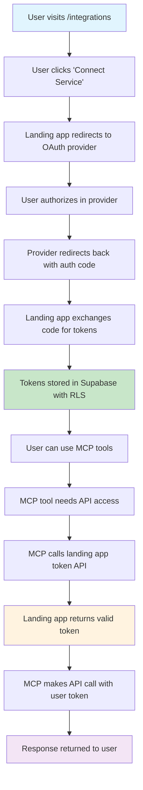

# OAuth2 Integration Plan for EdnSy Platform

## 📋 Executive Summary

This document outlines the comprehensive OAuth2 integration strategy for the EdnSy platform, enabling users to securely connect their third-party services (Google Workspace, Notion, Slack, Stripe) and use them through our MCP server. The implementation follows security best practices, provides seamless user experience, and maintains scalability for future integrations.

## 🎯 Objectives

- **Secure OAuth2 Integration**: Implement secure OAuth2 flows for multiple services
- **User Token Management**: Store and manage user-specific OAuth tokens securely
- **MCP Server Integration**: Enable MCP tools to use user-specific tokens dynamically
- **Seamless User Experience**: Provide intuitive connection/disconnection flows
- **Token Refresh Automation**: Automatically refresh expired tokens
- **Multi-tenant Architecture**: Support multiple users with isolated token storage

## 🏗️ Architecture Overview



## 🔐 Security Model

### **Credential Storage**
- **OAuth Credentials**: Stored server-side only in environment variables
- **User Tokens**: Encrypted and stored in Supabase with Row Level Security (RLS)
- **Access Control**: Users can only access their own tokens
- **Token Refresh**: Handled server-side with secure credential access

### **Data Flow Security**
- **Frontend**: Never exposes OAuth credentials or user tokens
- **Backend**: All sensitive operations happen server-side
- **API Communication**: Secure communication between MCP and landing app
- **Session Management**: Leverages existing Supabase authentication

## 🗄️ Database Schema

### **User OAuth Tokens Table**

```sql
-- Create table for storing user OAuth tokens
CREATE TABLE user_oauth_tokens (
  id UUID DEFAULT gen_random_uuid() PRIMARY KEY,
  user_id UUID REFERENCES auth.users(id) ON DELETE CASCADE,
  service_name TEXT NOT NULL CHECK (service_name IN ('google', 'notion', 'slack', 'stripe')),
  access_token TEXT NOT NULL,
  refresh_token TEXT,
  expires_at TIMESTAMP WITH TIME ZONE,
  scope TEXT,
  token_type TEXT DEFAULT 'Bearer',
  created_at TIMESTAMP WITH TIME ZONE DEFAULT NOW(),
  updated_at TIMESTAMP WITH TIME ZONE DEFAULT NOW(),
  
  UNIQUE(user_id, service_name)
);

-- Enable Row Level Security
ALTER TABLE user_oauth_tokens ENABLE ROW LEVEL SECURITY;

-- Users can only access their own tokens
CREATE POLICY "Users can view own tokens" ON user_oauth_tokens
  FOR SELECT USING (auth.uid() = user_id);

CREATE POLICY "Users can insert own tokens" ON user_oauth_tokens
  FOR INSERT WITH CHECK (auth.uid() = user_id);

CREATE POLICY "Users can update own tokens" ON user_oauth_tokens
  FOR UPDATE USING (auth.uid() = user_id);

CREATE POLICY "Users can delete own tokens" ON user_oauth_tokens
  FOR DELETE USING (auth.uid() = user_id);

-- Auto-update timestamp trigger
CREATE OR REPLACE FUNCTION update_updated_at_column()
RETURNS TRIGGER AS $$
BEGIN
    NEW.updated_at = NOW();
    RETURN NEW;
END;
$$ language 'plpgsql';

CREATE TRIGGER update_user_oauth_tokens_updated_at 
    BEFORE UPDATE ON user_oauth_tokens 
    FOR EACH ROW EXECUTE FUNCTION update_updated_at_column();

-- Index for performance
CREATE INDEX idx_user_oauth_tokens_user_service ON user_oauth_tokens(user_id, service_name);
CREATE INDEX idx_user_oauth_tokens_expires_at ON user_oauth_tokens(expires_at);
```

## 🚀 Implementation Phases

### **Phase 1: Foundation & Google OAuth (Week 1-2)**

#### **1.1 Environment Setup**
```bash
# apps/landing/.env.local
# OAuth App Credentials
GOOGLE_CLIENT_ID=your_google_client_id
GOOGLE_CLIENT_SECRET=your_google_client_secret
GOOGLE_REDIRECT_URI=https://yourdomain.com/auth/google/callback

# MCP Integration
MCP_API_KEY=your_secure_mcp_api_key
LANDING_APP_URL=https://yourdomain.com

# Supabase (existing)
SUPABASE_URL=your_supabase_url
SUPABASE_ANON_KEY=your_supabase_anon_key
SUPABASE_SERVICE_ROLE_KEY=your_service_role_key
```

#### **1.2 Google OAuth App Creation**
1. Visit [Google Cloud Console](https://console.cloud.google.com/)
2. Create new project or select existing
3. Enable required APIs:
   - Google Calendar API
   - Gmail API
   - Google Sheets API
   - Google Drive API
4. Configure OAuth consent screen
5. Create OAuth 2.0 credentials
6. Add authorized redirect URIs

#### **1.3 Database Migration**
```bash
# Run the database schema creation script
psql -h your-supabase-host -U postgres -d postgres -f scripts/setup-oauth-tokens.sql
```

### **Phase 2: Core OAuth Infrastructure (Week 3-4)**

#### **2.1 Token Management Service**
```typescript
// apps/landing/src/lib/services/token-manager.ts
export class TokenManager {
  static async getValidToken(userId: string, serviceName: string): Promise<string>
  static async refreshToken(serviceName: string, refreshToken: string): Promise<TokenData>
  static async storeTokens(userId: string, serviceName: string, tokens: TokenData): Promise<void>
  static async removeTokens(userId: string, serviceName: string): Promise<void>
}
```

#### **2.2 OAuth Callback Handlers**
- `/auth/google/callback` - Handle Google OAuth response
- `/auth/notion/callback` - Handle Notion OAuth response
- `/auth/slack/callback` - Handle Slack OAuth response
- `/auth/stripe/callback` - Handle Stripe OAuth response

#### **2.3 Integration Management API**
- `POST /api/integrations/connect` - Initiate OAuth flow
- `POST /api/tokens/refresh` - Refresh expired tokens
- `DELETE /api/integrations/disconnect` - Remove integration

### **Phase 3: Frontend Integration (Week 5-6)**

#### **3.1 Integrations Page**
- Service connection cards
- Connection status indicators
- Token health monitoring
- Disconnect functionality

#### **3.2 OAuth Flow UI**
- Service selection interface
- Authorization progress indicators
- Success/error messaging
- Connection status updates

### **Phase 4: MCP Server Integration (Week 7-8)**

#### **4.1 Token Resolution System**
- MCP tools request tokens via secure API
- Landing app validates requests and returns tokens
- Automatic token refresh when needed

#### **4.2 Updated MCP Tools**
- Remove hardcoded environment variables
- Add userId parameter to all functions
- Implement token-based authentication

### **Phase 5: Additional Services & Polish (Week 9-10)**

#### **5.1 Notion Integration**
- Create Notion OAuth app
- Implement Notion API tools
- Handle Notion-specific scopes

#### **5.2 Slack Integration**
- Create Slack OAuth app
- Implement Slack API tools
- Handle Slack-specific permissions

#### **5.3 Stripe Integration**
- Create Stripe Connect app
- Implement Stripe API tools
- Handle Stripe-specific scopes

## 🔧 Technical Implementation

### **1. OAuth Service Classes**

```typescript
// apps/landing/src/lib/services/oauth/google-oauth.ts
export class GoogleOAuthService {
  static getAuthUrl(): string
  static async exchangeCodeForTokens(code: string): Promise<TokenData>
  static async refreshTokens(refreshToken: string): Promise<TokenData>
  static async revokeTokens(accessToken: string): Promise<void>
}

// Similar classes for Notion, Slack, and Stripe
```

### **2. Token Refresh Scheduler**

```typescript
// apps/landing/src/lib/jobs/token-refresh-scheduler.ts
export class TokenRefreshScheduler {
  static start(): void
  static stop(): void
  static async processExpiringTokens(): Promise<void>
  static async refreshToken(token: OAuthToken): Promise<void>
}
```

### **3. MCP Integration Layer**

```typescript
// apps/landing/src/routes/api/mcp/tokens/+server.ts
export async function POST({ request }) {
  // Validate MCP API key
  // Get user ID from request
  // Return valid token for requested service
}
```

### **4. Frontend Components**

```svelte
<!-- apps/landing/src/lib/components/integrations/ServiceCard.svelte -->
<script>
  export let service: OAuthService;
  export let connectionStatus: ConnectionStatus;
  
  async function connect() { /* ... */ }
  async function disconnect() { /* ... */ }
</script>

<div class="service-card">
  <!-- Service information and connection controls -->
</div>
```

## 📱 User Experience Flow

### **1. Initial Connection**
1. User visits `/integrations` page
2. User clicks "Connect [Service]" button
3. User is redirected to service's OAuth page
4. User authorizes the application
5. User is redirected back with success message
6. Service appears as "Connected" with green status

### **2. Using Connected Services**
1. User accesses MCP tools that require the service
2. MCP server automatically resolves user's token
3. Token is refreshed if needed (transparent to user)
4. API calls are made using user's credentials
5. Results are returned to user

### **3. Token Management**
1. System monitors token expiration
2. Automatic refresh happens in background
3. Users see connection status indicators
4. Failed refreshes prompt reconnection
5. Users can manually disconnect services

## 🧪 Testing Strategy

### **1. Unit Tests**
- Token management functions
- OAuth service classes
- Database operations
- API endpoint handlers

### **2. Integration Tests**
- OAuth flow completion
- Token refresh scenarios
- MCP tool integration
- Error handling paths

### **3. End-to-End Tests**
- Complete user journey
- Service connection/disconnection
- MCP tool usage
- Token expiration handling

### **4. Security Tests**
- Token isolation between users
- API key validation
- OAuth flow security
- Database access controls

## 📊 Monitoring & Analytics

### **1. Token Health Metrics**
- Active connections per service
- Token refresh success rates
- Failed authentication attempts
- Service usage patterns

### **2. Error Tracking**
- OAuth flow failures
- Token refresh errors
- API call failures
- User reconnection patterns

### **3. Performance Metrics**
- Token resolution latency
- OAuth flow completion time
- API response times
- Database query performance

## 🚨 Error Handling & Recovery

### **1. OAuth Flow Failures**
- Invalid authorization codes
- Expired authorization codes
- Service API errors
- Network timeouts

### **2. Token Refresh Failures**
- Invalid refresh tokens
- Service API errors
- Rate limiting
- Service unavailability

### **3. Recovery Strategies**
- Automatic retry with exponential backoff
- User notification of issues
- Graceful degradation
- Manual reconnection prompts

## 🔄 Maintenance & Updates

### **1. Regular Tasks**
- Monitor token refresh success rates
- Update OAuth app configurations
- Review and rotate API keys
- Monitor service API changes

### **2. Service Updates**
- API version migrations
- New scope requirements
- Security policy updates
- Feature deprecations

### **3. User Communication**
- Service maintenance notifications
- Required reconnection prompts
- Feature availability updates
- Security advisories

## 📚 Documentation & Training

### **1. Developer Documentation**
- API endpoint specifications
- Database schema documentation
- OAuth flow diagrams
- Error code reference

### **2. User Documentation**
- Integration setup guides
- Troubleshooting guides
- FAQ sections
- Video tutorials

### **3. Admin Documentation**
- System monitoring guides
- Troubleshooting procedures
- Emergency response plans
- Maintenance schedules

## 🎯 Success Metrics

### **1. User Adoption**
- Integration connection rates
- Service usage frequency
- User retention with integrations
- Feature discovery rates

### **2. System Performance**
- Token refresh success rates
- API response times
- Error rates
- System uptime

### **3. Business Impact**
- User engagement increase
- Feature usage growth
- Support ticket reduction
- User satisfaction scores

## 🚀 Future Enhancements

### **1. Additional Services**
- Microsoft 365 integration
- HubSpot integration
- Salesforce integration
- Custom API integrations

### **2. Advanced Features**
- Bulk data synchronization
- Webhook integrations
- Real-time notifications
- Advanced analytics

### **3. Enterprise Features**
- Team management
- Role-based access control
- Audit logging
- Compliance reporting

## 📋 Implementation Checklist

### **Phase 1: Foundation**
- [ ] Set up environment variables
- [ ] Create Google OAuth app
- [ ] Implement database schema
- [ ] Create basic token management service

### **Phase 2: Core Infrastructure**
- [ ] Implement OAuth callback handlers
- [ ] Create token refresh system
- [ ] Set up integration management API
- [ ] Implement security validation

### **Phase 3: Frontend**
- [ ] Create integrations page
- [ ] Implement OAuth flow UI
- [ ] Add connection status indicators
- [ ] Create service management components

### **Phase 4: MCP Integration**
- [ ] Update MCP tools for token usage
- [ ] Implement token resolution API
- [ ] Test MCP tool functionality
- [ ] Validate security measures

### **Phase 5: Polish & Launch**
- [ ] Add remaining OAuth services
- [ ] Implement comprehensive error handling
- [ ] Add monitoring and analytics
- [ ] Create user documentation
- [ ] Conduct security review
- [ ] Launch beta testing

## 🔒 Security Checklist

- [ ] OAuth credentials stored server-side only
- [ ] User tokens encrypted in database
- [ ] Row Level Security implemented
- [ ] API key validation for MCP access
- [ ] HTTPS enforced in production
- [ ] CSRF protection implemented
- [ ] Rate limiting configured
- [ ] Audit logging enabled
- [ ] Security headers configured
- [ ] Regular security reviews scheduled

## 📞 Support & Resources

### **Technical Support**
- Development team contact information
- Issue reporting procedures
- Emergency contact protocols
- Escalation procedures

### **External Resources**
- OAuth provider documentation
- API reference materials
- Security best practices
- Compliance guidelines

---

**Document Version**: 1.0  
**Last Updated**: December 2024  
**Next Review**: January 2025  
**Maintained By**: EdnSy Development Team
