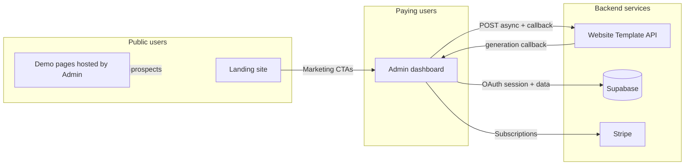

# EdnSy monorepo — master documentation

This folder is the **entry point** for understanding how the repository fits together. App-specific details stay in each app (`apps/<name>/README.md`, `docs/` under that app); this document answers **what ships where**, **how the pieces connect**, and **where to read next**. Release notes: **[CHANGELOG.md](CHANGELOG.md)** (hub) and each app’s **`docs/CHANGELOG.md`**.

---

## Why this document exists

| Need | What master docs give you |
|------|---------------------------|
| **Onboarding** | One place to see all deployable units and their roles before diving into three READMEs. |
| **Boundaries** | Clear ownership: marketing site vs product app vs generator service avoids mixing env vars, Supabase usage, and deployment roots. |
| **Integration** | Paid demo flow spans **Admin** and **Website Template**; that contract is easy to miss if you only read one app. |
| **Operations** | Points to cron, callbacks, and shared secrets without duplicating long setup (those stay in app READMEs). |
| **Product** | Links to PRDs and tasks so scope stays traceable across apps. |

---

## The three applications

These are the primary **user-facing or customer-critical** codebases in `apps/`:

| Application | Path | Role | Typical deploy |
|-------------|------|------|----------------|
| **Ed & Sy Admin** | [`apps/admin`](../apps/admin/) | Product: dashboard, prospects, demos, billing, auth, CRM integrations, demo pages served to end prospects. | Vercel (root directory `apps/admin`) |
| **Marketing site** | [`apps/landing`](../apps/landing/) | Public website: services, case studies, blog, SEO landing pages, contact. No admin product logic. | Vercel or similar (root `apps/landing`) |
| **Website Template** | [`apps/website-template`](../apps/website-template/) | Backend service: generates landing HTML from JSON; Admin calls it for paid demo jobs and receives callbacks. | Node host (e.g. Render) |

**Supporting deployment (not a fourth “product” app, but part of ops):** [`apps/cron-worker`](../apps/cron-worker/) — Cloudflare Worker that hits Admin cron routes and keeps Website Template warm. See its README when wiring production schedules.

---

## How they connect (system context)

- **Landing → Admin:** Marketing links (for example “Sign in”, product URLs) send users to the Admin origin you configure in production.
- **Admin → Supabase:** Primary database, auth session alignment for Realtime, storage for demos.
- **Admin → Stripe:** Checkout and portal (`apps/admin` README).
- **Admin → Website Template:** `DEMO_GENERATOR_URL`, API key, and `DEMO_CALLBACK_SECRET`; async job completes via `POST /api/demo/generation-callback` on Admin. Contract: [`apps/admin/docs/demo-payload-website-template.md`](../apps/admin/docs/demo-payload-website-template.md).

---

## Responsibility boundaries

| Concern | Owner |
|---------|--------|
| Prospect CRM sync, demo jobs, send email, Stripe | **Admin** |
| Public company marketing, blog, lead positioning | **Landing** |
| HTML generation API (Claude + dental renderer), OpenAPI | **Website Template** |
| Product requirements for the outreach product | [`apps/admin/docs/prd.md`](../apps/admin/docs/prd.md) |
| Marketing positioning doc (agency narrative) | [`apps/landing/PRD.md`](../apps/landing/PRD.md) |

**Do not** use Admin dashboard UI components (shadcn) on Landing or public demo pages; see `.cursor/rules` and Admin README.

---

## Documentation map

### Monorepo root (`docs/`)

| Doc | Purpose |
|-----|---------|
| [README.md](README.md) | This index (three apps, boundaries, diagram) |
| [CHANGELOG.md](CHANGELOG.md) | **Master changelog hub** — links to each app’s `docs/CHANGELOG.md` |

### Admin (`apps/admin`)

| Doc | Purpose |
|-----|---------|
| [README.md](../apps/admin/README.md) | Env vars, migrations list, routes, local dev |
| [docs/architecture.md](../apps/admin/docs/architecture.md) | Stack, engines, Website Template integration |
| [docs/api-conventions.md](../apps/admin/docs/api-conventions.md) | REST `/api/*` patterns |
| [docs/prd.md](../apps/admin/docs/prd.md) | Product requirements |
| [docs/demo-payload-website-template.md](../apps/admin/docs/demo-payload-website-template.md) | JSON contract for Website Template |
| [docs/CHANGELOG.md](../apps/admin/docs/CHANGELOG.md) | Release history (Keep a Changelog) |
| [tasks/README.md](../apps/admin/tasks/README.md) | Taskmaster tasks file location |

### Landing (`apps/landing`)

| Doc | Purpose |
|-----|---------|
| [README.md](../apps/landing/README.md) | Setup, route overview |
| [PRD.md](../apps/landing/PRD.md) | Positioning and narrative |
| [docs/CHANGELOG.md](../apps/landing/docs/CHANGELOG.md) | Marketing site release notes |
| [tasks/README.md](../apps/landing/tasks/README.md) | Marketing-site task list |

### Website Template (`apps/website-template`)

| Doc | Purpose |
|-----|---------|
| [README.md](../apps/website-template/README.md) | CLI, HTTP API, env, curl examples |
| [docs/architecture.md](../apps/website-template/docs/architecture.md) | Modes (Claude vs dental renderer), Express layout |
| [docs/CHANGELOG.md](../apps/website-template/docs/CHANGELOG.md) | Generator service release notes |

### Monorepo scripts

| Doc | Purpose |
|-----|---------|
| [scripts/README.md](../scripts/README.md) | Cron mock, key sync, helpers |

---

## Local development (quick)

- **Admin:** `cd apps/admin && pnpm dev` (or `npm run dev`). Needs `.env` per Admin README (Supabase, Google OAuth, etc.).
- **Landing:** `cd apps/landing && pnpm dev`.
- **Website Template:** `cd apps/website-template && npm start` for API; Admin points `DEMO_GENERATOR_URL` at it for full paid demo flow.

Use the root `package.json` scripts only for cross-repo helpers (for example `cron:mock`); there is no single dev command that runs all three apps.

---

## Tasks and planning

- **Admin:** `apps/admin/tasks/tasks.json` (see `apps/admin/tasks/README.md`).
- **Landing:** `apps/landing/tasks/tasks.json` (see `apps/landing/tasks/README.md`).

---

## Versioning

- **Changelog hub:** [`CHANGELOG.md`](CHANGELOG.md) — links to each app’s `docs/CHANGELOG.md`.
- **Admin:** `apps/admin/package.json`, [`apps/admin/docs/CHANGELOG.md`](../apps/admin/docs/CHANGELOG.md), policy [`apps/admin/docs/VERSION.md`](../apps/admin/docs/VERSION.md).

---

*Last updated: March 2026. When you add a new deployable app or change cross-app contracts, update this file and the relevant app README.*
